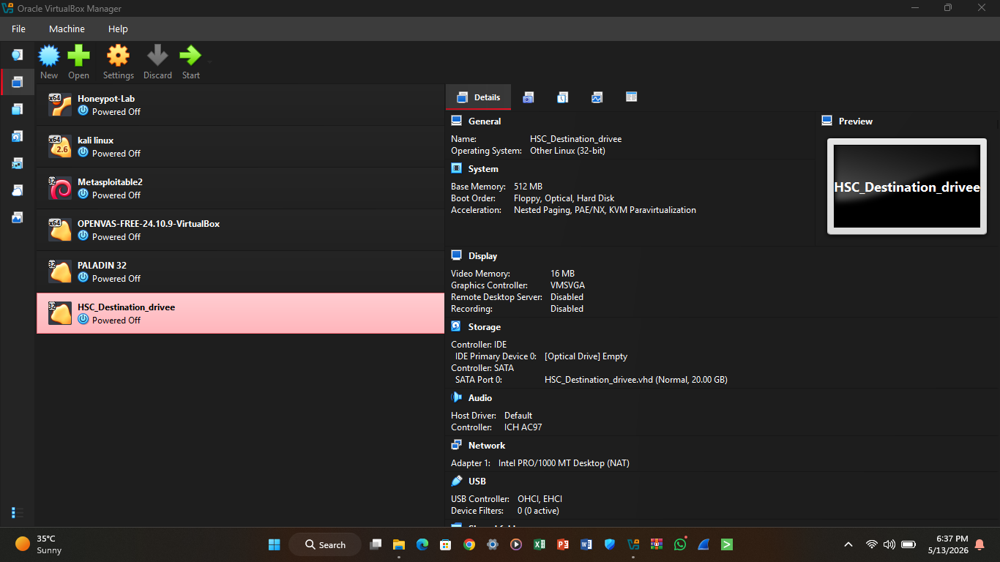
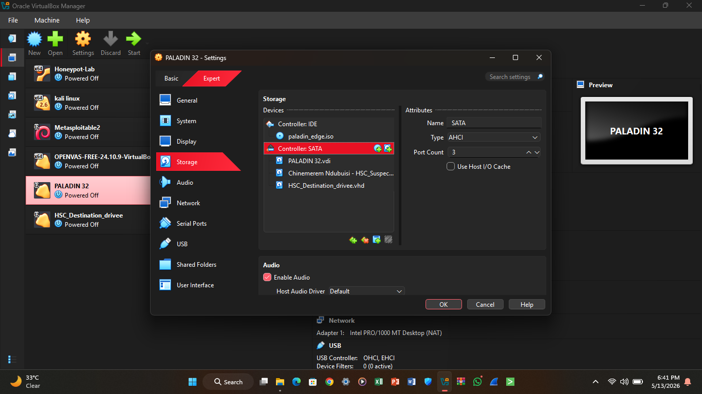
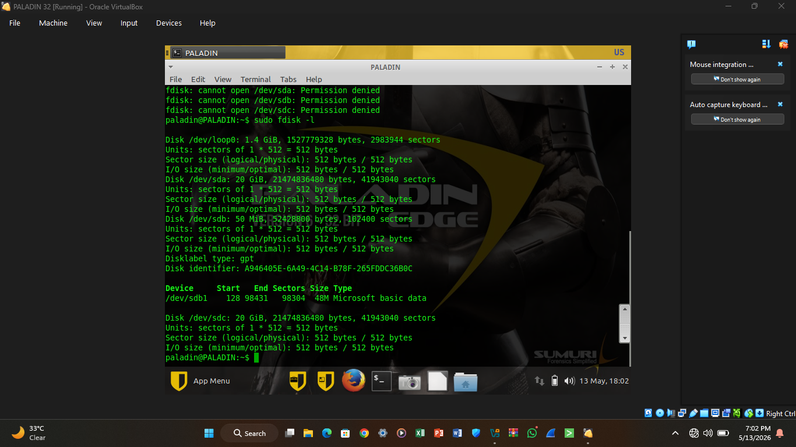
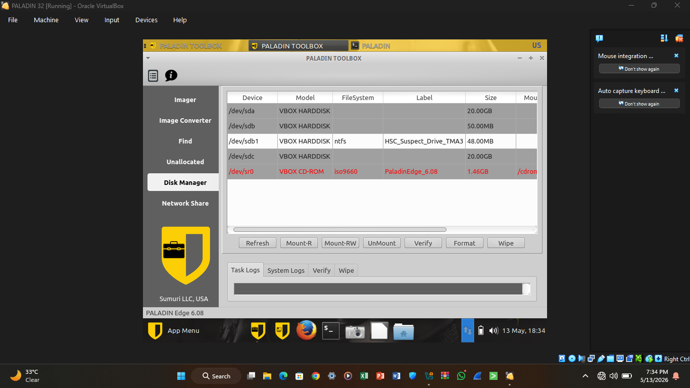
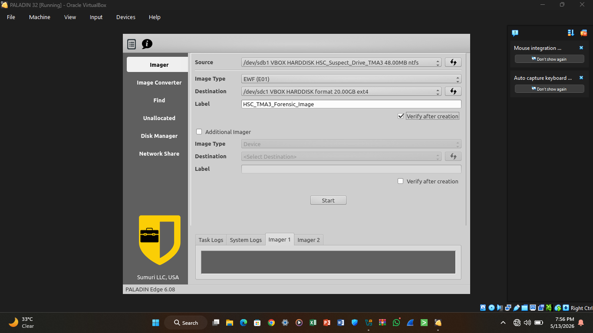
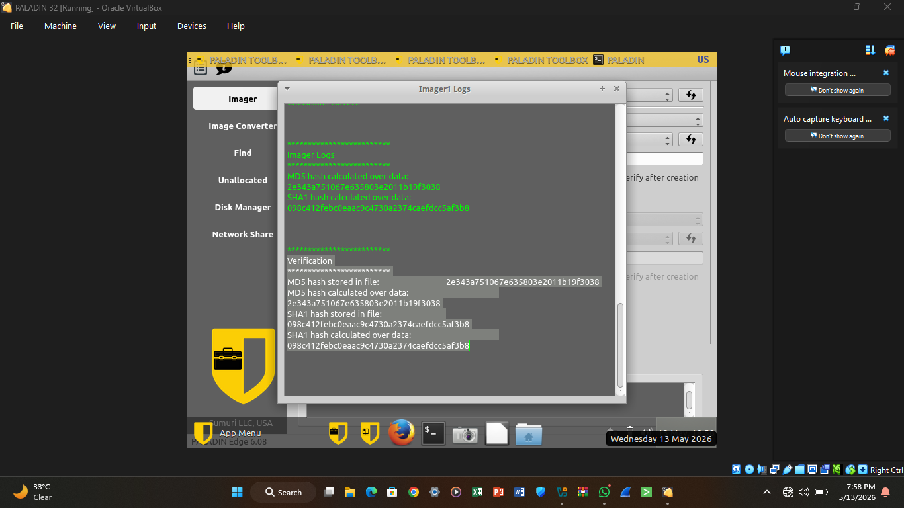

# Forensic Imaging of Virtual Hard Disk (.E01 Format)


This repository documents the forensic acquisition and verification process carried out during the TMA3 Digital Forensics practical assignment using FTK Imager within the Paladin forensic environment.

---

# Table of Contents

- [Case Overview](#case-overview)
- [Objective](#objective)
- [Tools and Environment](#tools-and-environment)
- [Virtual Disk Preparation](#virtual-disk-preparation)
- [Virtual Machine Configuration](#virtual-machine-configuration)
- [Paladin Environment](#paladin-environment)
- [Disk Identification](#disk-identification)
- [Destination Disk Formatting](#destination-disk-formatting)
- [Forensic Imaging Process](#forensic-imaging-process)
- [Hash Verification](#hash-verification)
- [Generated Evidence Files](#generated-evidence-files)
- [Evidence Summary](#evidence-summary)
- [Challenges Encountered](#challenges-encountered)
- [Conclusion](#conclusion)

---

# Case Overview

This investigation involved the acquisition of a forensic image from a suspect virtual hard disk using industry-standard forensic procedures.

The acquisition was performed using FTK Imager within the Paladin forensic environment while maintaining evidence integrity through cryptographic hash verification.

---

# Objective

The primary objectives of this task were:

- Create a forensic image of the suspect virtual hard disk
- Preserve evidence integrity during acquisition
- Generate a forensic image in `.E01` format
- Verify acquisition integrity using MD5 and SHA1 hashes
- Document forensic acquisition procedures and evidence artifacts

---

# Tools and Environment

| Component | Description |
|-----------|-------------|
| Virtualization Platform | VirtualBox |
| Forensic Environment | Paladin |
| Imaging Tool | FTK Imager |
| Evidence Format | E01 |
| Verification Algorithms | MD5, SHA1 |
| Source Evidence | HSC_Suspect_Harddrive_TMA.vhd |
| Destination Drive | HSC_Destination_drive.vhd |

---

# Virtual Disk Preparation

A destination virtual hard disk was created to store the acquired forensic evidence image.

## Actions Performed

- Created destination VHD
- Selected VHD disk format
- Configured dynamic allocation
- Attached destination disk to forensic environment

## Screenshot


## Virtual Machine Configuration

The suspect evidence disk and destination storage disk were attached to the Paladin forensic virtual machine.

### Attached Devices

```
HSC_Suspect_Harddrive_TMA.vhd
HSC_Destination_drive.vhd
Paladin ISO
```

### Screenshot


---

## Paladin Environment

The Paladin forensic environment was booted successfully and used as the acquisition workstation.

### Actions Performed

- Booted Paladin forensic environment
- Accessed forensic utilities
- Verified disk visibility using Linux forensic disk utilities

### Screenshot


---

## Disk Identification

Attached disks were identified.

### Detected Devices

```
/dev/sda   -> Paladin System Disk
/dev/sdb1  -> Suspect Evidence Disk
/dev/sdc1  -> Destination Storage Disk
```

The suspect disk and destination disk were identified based on size and attached device configuration.

### Screenshot Placeholder


---

## Destination Disk Formatting

The destination disk was initially unformatted and required filesystem initialization before acquisition.

### Actions Performed

- Opened Disk Manager
- Created partition on destination disk
- Formatted partition using ext4 filesystem
- Mounted writable destination partition

### Mounted Destination

```
/dev/sdc1
Filesystem: ext4
Mount Mode: RW
```

---

## Forensic Imaging Process

FTK Imager was used to acquire the forensic image of the suspect virtual hard disk.

### Acquisition Configuration

| Setting | Value |
|----------|----------|
| Source Disk | /dev/sdb1 |
| Destination Disk | /dev/sdc1 |
| Image Format | E01 |
| Verification | Enabled |
| Hash Algorithms | MD5, SHA1 |

### Acquisition Steps

- Opened FTK Imager
- Selected suspect disk as evidence source
- Configured E01 acquisition format
- Selected mounted destination storage
- Enabled verification after acquisition
- Started forensic imaging process

### Screenshot


---

## Hash Verification

MD5 and SHA1 verification was performed automatically after acquisition.

### Verification Algorithms

```
MD5
SHA1
```

The generated hashes confirmed the integrity of the forensic image and verified that the acquired evidence matched the original source disk.

### Screenshot Placeholder


---

## Generated Evidence Files

The forensic acquisition process generated multiple evidence and documentation files.

### Evidence Files

```
HSC_TMA3_FORENSIC_IMAGE.E01
complete.log
verify.log
source.info
log
```

### File Descriptions

| File | Description |
|----------|----------|
| .E01 | Main forensic evidence image |
| complete.log | Acquisition completion log |
| verify.log | Hash verification results |
| source.info | Source disk metadata |
| log | Imaging activity log |

### Screenshot


---

## Evidence Summary

### Source Evidence

```
HSC_Suspect_Harddrive_TMA.vhd
```

### Destination Evidence Storage

```
HSC_Destination_drive.vhd
```

### Forensic Image Format

```
.E01 (Expert Witness Format)
```

### Integrity Verification

```
MD5 Hash Verification: Successful
SHA1 Hash Verification: Successful
```

---

## Challenges Encountered

Several technical challenges were encountered during the forensic acquisition process.

### Identified Issues

- Destination drive initially unformatted
- Destination disk required manual mounting
- FTK Imager destination selection behavior differed from older versions
- Correct source and destination disk identification was critical

### Resolutions Applied

- Formatted destination disk using ext4
- Mounted destination partition in RW mode
- Verified disks using `fdisk -l`
- Confirmed acquisition destination prior to imaging

---

## Conclusion

The forensic imaging process was completed successfully using FTK Imager within the Paladin forensic environment.

A valid forensic image was generated in E01 format and verified using MD5 and SHA1 hash algorithms to ensure evidence integrity.

This exercise provided practical exposure to:

- Digital evidence acquisition
- Forensic imaging procedures
- Evidence verification
- Disk management within forensic environments
- Forensic documentation workflows

---

## Author

**Chinemerem Ndubuisi**

*Digital Forensics / Cybersecurity Analyst*
